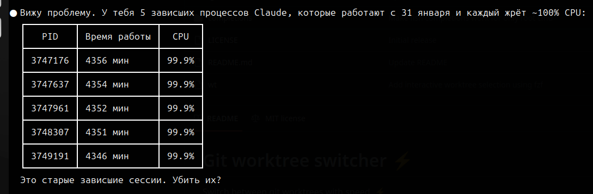

За прошлый год мы потестили достаточно большое количество ИИ-инструментов для разработки (Cursor, Claude Code, Codex, Cline, Aider, RooCode, Kilo, Augment), тут есть [обзорный пост](https://crazyfrogspb.github.io/2025/09/22/%D0%B8%D0%B8-%D0%B8%D0%BD%D1%81%D1%82%D1%80%D1%83%D0%BC%D0%B5%D0%BD%D1%82%D1%8B-%D0%B2-%D1%80%D0%B0%D0%B7%D1%80%D0%B0%D0%B1%D0%BE%D1%82%D0%BA%D0%B5-opinionated-guide/). Какие-то отбросили почти сразу, какие-то прям поиспользовали и даже посравнивали на одних и тех же задачах. В итоге сейчас на уровне компании мы внедряем Claude Code и опционально компенсируем подписку на Cursor. Почему Claude Code?

- Главная причина - на субъективных ненаучных сравнениях качество лучше, чем у конкурентов (хотя это может меняться от модели к модели)
- Богатая эко-система плагинов и в целом это популярный развивающийся инструмент
- Адекватная цена - за 35 (Team-план) или 100 (личный Max) долларов мы получаем практически безлимитные запросы (хотя и это может меняться, судя по [последним новостям](https://www.reddit.com/r/ClaudeCode/comments/1s4kv14/no_title_needed/))

Если вы никогда не использовали CC или подобные инструменты, то рекомендуем забить на гайды в стиле "запускаем 5-10 агентов параллельно" и поработать сначала в максимально простом режиме - **без плагинов**, с **одной открытой вкладкой**, можно через плагин для IDE. Так вы лучше поймёте сильные и слабые стороны, как лучше формулировать свои запросы и не пропустите момент, когда его нужно останавливать.



## Если вы в России

Мы используем такую схему - VPN настроен через Shadowsocks (или xray-core), сверху поднят [Privoxy](https://www.privoxy.org/), так как CC не работал с SOCKS5-прокси.

Схема простая, ставим Privoxy (`sudo apt-get install privoxy`), в конфиг `/etc/privoxy/config` добавляем строчку

`forward-socks5t / 127.0.0.1:1080 .` или `forward-socks5t / 127.0.0.1:10808 .` в зависимости от используемого протокола.

И перезапускаем: `sudo systemctl restart privoxy`.

Для удобства в `~/.bash_aliases` можно поставить подобные команды:

```bash
alias setproxy='export http_proxy=http://127.0.0.1:8118; export https_proxy=http://127.0.0.1:8118; export no_proxy=localhost,127.0.0.1; export HTTP_PROXY=$http_proxy; export HTTPS_PROXY=$https_proxy; export NO_PROXY=$no_proxy'

alias unsetproxy='unset HTTP_PROXY; unset HTTPS_PROXY; unset NO_PROXY; unset http_proxy; unset https_proxy; unset no_proxy'
```

В no_proxy можно добавить любые адреса, к которым CC должен обращаться не через VPN.

Теперь в терминале достаточно набрать setproxy и потом уже claude.

## Работа с CC в IDE

Есть плагины для популярных IDE (VSCode, PyCharm). Они позволяют удобно изучать изменения, которые сделал агент, прямо в IDE.

Ещё один вариант — скачать [Zed](https://zed.dev/download), симпатичный IDE с нативной интеграцией с CC через [ACP](https://agentclientprotocol.com/get-started/introduction).

## Советы новичкам
- Не бросайтесь генерить длиннющий CLAUDE.md, устанавливать кучу плагинов и подключать все MCP. Двигайтесь постепенно, по мере необходимости
- Изучите документацию и основные настройки вашего инструмента (клодовские лежат [тут](https://code.claude.com/docs/en/settings))
- Сначала поработайте в режиме ручного одобрения каждой команды. Никакого --dangerously-skip-permissions, особенно пока вы не настроили себе sandbox и прочие разрешения
- Изучите важные команды вашего инструмента, например, для Клода часто используются такие - /rewind, /resume, /fork, /rename, /compact, /clear
- Установите какой-нибудь плагин для трекинга использования лимитов, чтоб понимать, с какой скоростью вы можете двигаться на вашей подписке. Например, [Claude HUD](https://github.com/jarrodwatts/claude-hud)
- После первоначальной настройки наберите в свежей сессии /context и изучите, что сразу же подгружается по дефолту в любую сессию
- Не забывайте для каждой задачи описывать Клоду, как он может и должен верифицировать качество своей работы (автотесты, Playwright/Camofox, сборка проекта в Docker, спросить юзера и так далее)
- Спустя какое-то время попробуйте поработать над одной и той же фичей в разных режимах - свободный промптинг, режим планирования, spec-driven фреймворк типа BMAD или OpenSpec. Прочувствуйте разницу, что больше подходит для каких типов задач

## Что ещё почитать

- [Детальный свежий гайд](https://sankalp.bearblog.dev/my-experience-with-claude-code-20-and-how-to-get-better-at-using-coding-agents/)
- [Безумный пайплайн создателя Claude Code](https://x.com/bcherny/status/2007179832300581177?lang=en)
- [Как CC пользуются в Anthropic](https://x.com/bcherny/status/2017742741636321619?t=rtE5PtnphMf785Z5dn4JqA&s=19)
- [Официальная документация](https://code.claude.com/docs/en/overview)
- [The Longform Guide to Everything Claude Code](https://x.com/affaanmustafa/status/2014040193557471352)
