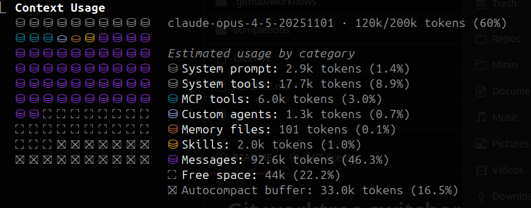

Разберем на примере Claude Code важные функции при работе с агентскими системами.

## Работаем с сессиями

Сессия - основной юнит работы в CC. Каждый раз, когда мы хотим решить какую-то новую задачку, мы создаём новую сессию, в контекст которой загружаются:

- Системный промпт и инструменты
- CLAUDE.md и правила
- Описания скиллов
- Описания включенных инструментов MCP
- Описание кастомных субагентов
- Если сессия не новая, то предыдущие сообщения

Важные команды для работы с сессиями:

- /rewind - откатиться на какой-то шаг разговора
- /resume - продолжить одну из прошлых сессий
- /fork - форкнуть сессию (создаётся копия текущей с новым айдишником)
- /rename - дать удобное название сессии вместо автоматического
- /compact - можно вручную триггернуть сжатие истории сессии. Необходимо при длинных сессиях, так как контекст моделей ограничен 

Авто-сжатие, кстати, постоянно теряет кучу важных деталей (например, какой скрипт с какими параметрами мы сейчас используем для дебаггинга), так что лучше такие штуки добавлять в md-файл со спецификацией задачи и сразу его прокидывать в контекст после сжатия.

Для продолжения сессий можно также запускать такие команды в терминале:

- `claude --continue` — последняя
- `claude --resume` — список для выбора
- `claude --continue --fork-session` — последняя сессия клонируется

Важно - по умолчанию сессии хранятся **30 дней** после последнего изменения. Это можно изменить в конфиге (настройка cleanupPeriodDays).

Очень удобная тулза для поиска сессий во всех проектах сразу: [Coversation Searchf](https://github.com/akatz-ai/cc-conversation-search).

Чтоб посмотреть, что занимает контекст - наберите /context. Лучше всего отключать неиспользуемые MCP и плагины. Скиллы подгружаются лениво (по умолчанию только название и краткое описание), но, например, тулзы в MCP грузятся целиком (если не включить настройку ENABLE_EXPERIMENTAL_MCP_CLI).

Полезные хоткеи:

- CTRL + U - стереть всю строчку
- Shift + Enter - новая строчка (сначала нужно запустить /terminal-setup). Если не работает, то печатаем бэкслэш \ и нажимаем Enter

## Режимы работы

У CC есть три основных режима работы, которые переключаются по **Shift+Tab**:

- **Дефолтный** - спрашивает пользователя перед каждым действием в рамках текущих настроенных [разрешений](https://code.claude.com/docs/en/iam#access-control-and-permissions).
    - /permissions - команда для установки разрешенных действий.
    - Ещё можно покопаться в файле [настроек](https://code.claude.com/docs/en/settings) или команде /config.
- **Авто-аксепт всех изменений** - YOLO-режим, уходим пить кофе и надеемся на чудо.
- **Режим планирования** - обсуждаем задачу и создаём маркдаун с описанием, пока не делаем никаких изменений.

Ещё можно поменять стиль ответов через команду /output-style:

- Дефолтный
- Объясняющий - более детально обосновывает свои решения
- Обучающий - не просто пишет код, а ещё и просит самому писать часть кода для улучшения понимания
